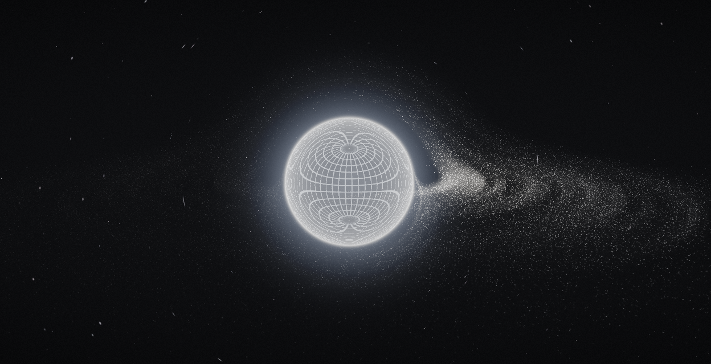

# Black Hole Accretion Disk

A real-time black hole and animated accretion disk simulation written in C++17 with raylib and OpenGL shaders.



## Features

- Animated, particle-like accretion disk with procedural detail
- Black hole shadow, wireframe event-horizon visualization, and gravitational lensing
- GPU particle simulation with an up to 50,000-particle CPU fallback
- Orbit camera with zoom and pan controls
- Optional ImGui controls and performance overlay

## Requirements

- C++17 compiler
- CMake 3.16 or newer
- OpenGL 4.3-capable GPU for GPU compute

By default, CMake downloads and builds raylib 6.0 and the ImGui dependencies on the first configure, so an internet connection is needed. To use a locally installed raylib 6.0 or newer built for OpenGL 4.3, configure with `-DBLACKHOLE_USE_SYSTEM_RAYLIB=ON`.

## Build

```sh
git clone <repository-url>
cd <repository-folder>
cmake -S . -B build
cmake --build build --config Release
```

The executable is written to `build/bin` (or `build/bin/Release` with a multi-configuration generator). Runtime shaders are copied there during the build.

## Controls

| Input | Action |
| --- | --- |
| Left mouse drag | Orbit camera |
| Right mouse drag | Pan camera |
| Mouse wheel | Zoom |
| Space | Pause or resume simulation |
| R | Reset camera and particles |
| `+` / `=` | Increase simulation speed |
| `-` / `_` | Decrease simulation speed |
| F1 | Toggle debug overlay |
| F2 | Toggle controls |
| F12 | Save a screenshot to `assets/screenshots/` |

## Project layout

- `src/` — application, camera, rendering, and particle simulation
- `src/utils/` — math, timing, random, and logging helpers
- `shaders/` — GPU simulation and rendering shaders
- `assets/screenshots/` — preview image and captured screenshots

## License

See [LICENSE](LICENSE).
